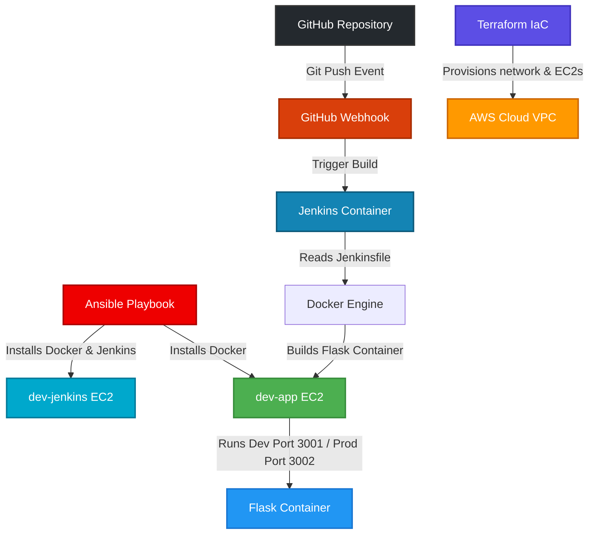
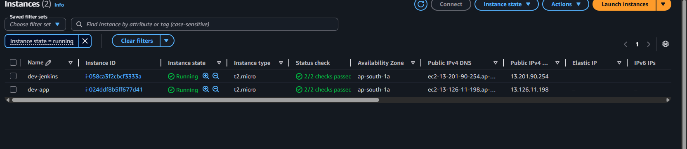

# devops-multi-env-platform

## Project Overview

This project demonstrates a complete end-to-end DevOps workflow where AWS infrastructure is provisioned using Terraform, servers are configured using Ansible, and a Dockerized Flask application is automatically deployed through a Jenkins Multibranch CI/CD Pipeline integrated with GitHub Webhooks.

The project focuses on learning real-world DevOps concepts including:
* Infrastructure as Code (IaC)
* Configuration Management
* Dockerized CI/CD
* Branch-aware deployments
* Jenkins automation
* GitHub Webhooks
* Cloud infrastructure automation
* Environment-based deployment strategy

## Goal of the Project

The goal of this project is to simulate a production-style DevOps pipeline where:
* Infrastructure is provisioned automatically.
* Jenkins is configured using automation.
* Application deployments happen automatically on Git pushes.
* Different branches represent different deployment environments.
* Docker containers are managed automatically through CI/CD pipelines.

## Tech Stack Used

* **AWS EC2**: Serves as the cloud computing platform to host our virtual servers. We use EC2 instances to host the Jenkins master and the Flask application deployment targets (development and production instances).
* **Terraform**: Used as the Infrastructure as Code (IaC) tool to provision virtual networks (VPC, Subnets, Route Tables), security groups, and EC2 instances on AWS in a declarative, reproducible manner.
* **Ansible**: Configures the software stack on the provisioned EC2 instances. It installs Docker, runs the Jenkins container on the Jenkins host, and sets up Docker on the application host.
* **Jenkins**: Orchestrates the entire CI/CD pipeline using a Jenkinsfile in a branch-aware Multibranch project.
* **Docker**: Containerizes the Flask application to ensure environment consistency between development and production.
* **GitHub**: Hosts the project repository and acts as the source control management (SCM) system.
* **GitHub Webhooks**: Triggers the Jenkins CI/CD pipeline automatically on every git push.
* **Python Flask**: A lightweight WSGI web application framework used to build our backend application.
* **Linux (Ubuntu)**: The standard operating system used for all EC2 instances, providing a stable environment for Docker and Jenkins.
* **Git**: Version control system to manage code changes and support the environment-based branching strategy.
* **SSH**: Secure Shell protocol used by Ansible to connect to EC2 instances and execute roles, and by Jenkins/developers to securely manage resources.

## Key Features

* Multi-EC2 infrastructure provisioning using Terraform.
* Automated server configuration using Ansible roles.
* Dockerized Jenkins setup.
* Branch-aware Jenkins Multibranch Pipeline.
* GitHub Webhook integration.
* Automated Docker image build process.
* Automated Docker container deployment.
* Development vs Production deployment logic.
* Flask application containerization.
* CI/CD automation.
* Infrastructure lifecycle management.
* Centralized configuration management.
* SSH-based automation.

## Architecture

The workflow implements a fully automated integration and delivery pipeline represented as:

GitHub -> Webhook -> Jenkins -> Docker Build -> Docker Deployment

* **Terraform provisions infrastructure**: Terraform manages the cloud infrastructure, creating virtual networks, subnets, gateways, route tables, security groups, and the necessary EC2 instances.
* **Ansible configures Jenkins and application servers**: Once the hosts are running, Ansible installs Docker, starts the Docker engine, and runs Jenkins on the Jenkins master node.
* **Jenkins runs inside Docker**: Jenkins is deployed inside a container to minimize environment drift and simplify state management.
* **Jenkins communicates with Docker daemon using Docker socket**: The Jenkins container mounts the host's Docker socket `/var/run/docker.sock` allowing it to run sibling containers directly on the host's Docker engine.
* **Flask app is containerized**: The Flask application is defined by a Dockerfile for reproducible packaging and deployment.
* **Branches control deployment behavior**: The Jenkins Multibranch Pipeline parses the branch name to determine target deployment attributes (such as the target host port).

Below is the colorful accent system architecture diagram:



## Project Structure

```bash
devops-multi-env-platform/
│
├── terraform/
│   ├── environments/
│   │   ├── dev/
│   │   │   └── dev.tfvars
│   │   └── prod/
│   │       └── prod.tfvars
│   ├── modules/
│   │   ├── ec2/
│   │   ├── network/
│   │   └── security/
│   ├── main.tf
│   ├── variables.tf
│   └── outputs.tf
│
├── ansible/
│   ├── inventories/
│   │   ├── dev/
│   │   │   └── hosts.ini
│   │   └── prod/
│   │       └── hosts
│   ├── playbooks/
│   │   └── site.yml
│   └── roles/
│       ├── app/
│       ├── docker/
│       ├── jenkins/
│       └── nginx/
│
├── app/
│   ├── app.py
│   ├── requirements.txt
│   └── Dockerfile
│
├── Jenkinsfile
├── README.md
└── .gitignore
```

### Directory Details
* [terraform/](file:///home/devopsuser/devops-multi-env-platform/terraform): Contains infrastructure configuration modules and environment parameters.
  * [terraform/main.tf](file:///home/devopsuser/devops-multi-env-platform/terraform/main.tf): Root Terraform entry point calling network, security, and ec2 modules.
  * [terraform/variables.tf](file:///home/devopsuser/devops-multi-env-platform/terraform/variables.tf): Schema for environment parameters.
  * [terraform/outputs.tf](file:///home/devopsuser/devops-multi-env-platform/terraform/outputs.tf): Exposes key infrastructure outputs such as server IPs.
  * [terraform/environments/dev/dev.tfvars](file:///home/devopsuser/devops-multi-env-platform/terraform/environments/dev/dev.tfvars): Input parameters for the development environment.
  * [terraform/environments/prod/prod.tfvars](file:///home/devopsuser/devops-multi-env-platform/terraform/environments/prod/prod.tfvars): Input parameters for the production environment.
* [ansible/](file:///home/devopsuser/devops-multi-env-platform/ansible): Contains configuration management code.
  * [ansible/ansible.cfg](file:///home/devopsuser/devops-multi-env-platform/ansible/ansible.cfg): Configuration settings for execution behavior and roles search path.
  * [ansible/inventories/dev/hosts.ini](file:///home/devopsuser/devops-multi-env-platform/ansible/inventories/dev/hosts.ini): Host lists and login attributes for the development environment.
  * [ansible/playbooks/site.yml](file:///home/devopsuser/devops-multi-env-platform/ansible/playbooks/site.yml): Root playbook linking target servers to tasks.
  * [ansible/roles/](file:///home/devopsuser/devops-multi-env-platform/ansible/roles): Subdirectories defining roles for containerization and server automation.
* [app/](file:///home/devopsuser/devops-multi-env-platform/app): Flask web application.
  * [app/app.py](file:///home/devopsuser/devops-multi-env-platform/app/app.py): Application source code.
  * [app/Dockerfile](file:///home/devopsuser/devops-multi-env-platform/app/Dockerfile): Container builds configuration.
  * [app/requirements.txt](file:///home/devopsuser/devops-multi-env-platform/app/requirements.txt): Python dependency manager specification.
* [Jenkinsfile](file:///home/devopsuser/devops-multi-env-platform/Jenkinsfile): Branch-aware declarative pipeline specifying CI/CD rules and environment deployment mappings.

## How the Workflow Works

1. Terraform provisions the virtual AWS VPC infrastructure, network subnets, and EC2 instances.
2. Multiple EC2 instances are created and configured to expose specific service ports.
3. Ansible executes tasks on the target hosts using SSH connection keys, setting up Docker and the containerized Jenkins master.
4. Jenkins runs inside a Docker container, mounting the host's Docker socket to allow Docker-in-Docker operations.
5. GitHub webhooks trigger an HTTP POST request to Jenkins upon receiving a commit push event in the repository.
6. Jenkins detects the pushed branch context through SCM.
7. Jenkins validates the branch name against the whitelist defined in the [Jenkinsfile](file:///home/devopsuser/devops-multi-env-platform/Jenkinsfile).
8. The Docker image for the Flask application is built automatically.
9. Existing containers from previous runs on the same branch are stopped and removed.
10. The new Docker container is run, exposing the respective port based on branch logic.
11. The application becomes accessible through the exposed ports (Port 3001 for development, Port 3002 for production).

## CI/CD Pipeline Explanation

The multibranch pipeline defines execution stages inside the [Jenkinsfile](file:///home/devopsuser/devops-multi-env-platform/Jenkinsfile).

### Pipeline Stages
* **Detect Branch**: Determines the source branch (such as `develop` or `main`) triggering the pipeline.
* **Validate Branch**: Ensures the branch is present in the `ALLOWED_BRANCHES` configuration to prevent building untested features.
* **Checkout Code**: Syncs the git repository workspace to the Jenkins build executor.
* **Build Docker Image**: Compiles the source using the [app/Dockerfile](file:///home/devopsuser/devops-multi-env-platform/app/Dockerfile) and tags the image with the branch name.
* **Stop Old Container**: Removes previously running application containers to prevent port conflicts.
* **Run Container**: Starts the application container, assigning Port 3001 to the `develop` environment and Port 3002 to the `main` environment.
* **Show Running Containers**: Executes a container listing output step as verification.

### Branch-Aware Deployments
* **develop branch**: Deploys to the development server or container mapped to Port 3001.
* **main branch**: Deploys to the production target mapped to Port 3002.

### Importance of Branch-Aware Pipelines
Branch-aware pipelines are a fundamental requirement in real-world DevOps environments. They ensure that changes are verified in sandbox environments prior to production exposure. By isolating the pipeline steps and routing configurations by branch, organizations prevent configuration drift, enforce separate security boundaries, and decouple feature testing from production operations.

## Branch Strategy

The branch strategy enforces environment separation:
* **develop** -> Deploys automatically to the development environment, running on Port 3001. Used for testing new features and staging integrations.
* **main** -> Deploys to the production environment on Port 3002. Represents stable releases.

* **Environment Isolation**: Keeping separate target servers and host ports prevents development builds from affecting production uptime.
* **Safer Deployments**: Encourages thorough staging and validation of configurations on `develop` before merging to `main`.
* **CI/CD Workflow Separation**: Controls access privileges and secrets, ensuring only authorized branch builds can deploy to production.

## Setup Instructions

### Prerequisites
* AWS Account with credentials configured.
* Terraform installed (>= 1.5.0).
* Ansible installed.
* Docker installed locally.
* Git client.
* GitHub account with SSH keys configured.
* SSH key pair (`~/.ssh/id_rsa` and `~/.ssh/id_rsa.pub`).

### Setup Steps

1. **Clone the repository:**
   ```bash
   git clone https://github.com/your-username/devops-multi-env-platform.git
   cd devops-multi-env-platform
   ```

2. **Provision Infrastructure:**
   Initialize and run Terraform from the terraform directory:
   ```bash
   cd terraform
   terraform init
   terraform plan -var-file=environments/dev/dev.tfvars
   terraform apply -var-file=environments/dev/dev.tfvars -auto-approve
   ```

3. **Configure Ansible Inventory:**
   Update [ansible/inventories/dev/hosts.ini](file:///home/devopsuser/devops-multi-env-platform/ansible/inventories/dev/hosts.ini) with the public IP addresses output by the Terraform run:
   ```ini
   [jenkins]
   dev-jenkins ansible_host=<TERRAFORM_JENKINS_IP> ansible_user=ubuntu

   [app]
   dev-app ansible_host=<TERRAFORM_APP_IP> ansible_user=ubuntu

   [all:vars]
   ansible_ssh_private_key_file=~/.ssh/id_rsa
   ```

4. **Configure Servers:**
   Run the Ansible playbook from the ansible directory:
   ```bash
   cd ../ansible
   ansible-playbook -i inventories/dev/hosts.ini playbooks/site.yml
   ```

5. **Configure Jenkins:**
   * Open `http://<TERRAFORM_JENKINS_IP>:8080` in your web browser.
   * Retrieve the initial admin password from the Jenkins container and configure credentials.
   * Add your private SSH key in Jenkins credentials to authenticate against GitHub.

6. **Configure Webhook:**
   * In the GitHub project repository, go to **Settings** > **Webhooks**.
   * Add a webhook with Payload URL: `http://<TERRAFORM_JENKINS_IP>:8080/github-webhook/`.
   * Choose Content Type `application/json` and register the webhook.

7. **Create Multibranch Pipeline:**
   * In Jenkins, create a **Multibranch Pipeline** item.
   * Add the Git source and configure the credentials.
   * Save to trigger the repository scan.

## Integrations

* **GitHub Webhooks**: Triggers the automation loop by publishing push notifications to the Jenkins listener.
* **Jenkins + Docker integration**: Utilizes the local Docker engine within Jenkins pipeline execution blocks to build images.
* **Docker socket integration**: Mounts the host's `/var/run/docker.sock` inside the Jenkins container, avoiding nested Docker virtualization.
* **AWS Security Groups**: Controls ingress/egress rules for port 8080 (Jenkins), port 22 (SSH), port 3001 (Dev App), and port 3002 (Prod App).
* **SSH communication**: Employs SSH key-based connections for Terraform key-pairs, Ansible commands, and GitHub cloning.

## Screenshots Section

### Terraform Infrastructure Creation


### AWS EC2 Instances Configured


### Ansible Playbook Execution


### Jenkins Multibranch Pipeline Dashboard


### Jenkins Pipeline Build Stage Working


### Branch-Aware Deployment Success


### Flask Application Output


## Future Improvements

* **Deploying to ECS/ECR**: Migrate from standalone Docker container host deployments to AWS Elastic Container Service (ECS) using Elastic Container Registry (ECR).
* **Kubernetes integration**: Transition host deployments to Amazon EKS for automated orchestration and scaling.
* **Reverse proxy using Nginx**: Put Nginx in front of application instances to handle load balancing and reverse proxying.
* **HTTPS setup**: Integrate Let's Encrypt certificates to secure communication channels.
* **Monitoring with Prometheus & Grafana**: Set up service metrics exporters to observe host and container load in real-time.
* **SonarQube integration**: Insert code quality gates in the Jenkins pipeline.
* **Jenkins Shared Libraries**: Standardize deployment scripts and pipeline steps inside a central library.
* **Blue-Green deployments**: Implement zero-downtime routing strategies during application upgrades.
* **Auto-scaling infrastructure**: Scale application nodes dynamically based on CPU/Memory load.
* **Terraform remote backend**: Store the Terraform state remotely in an AWS S3 bucket with DynamoDB locking.

## Key Learnings

* **Infrastructure as Code**: Experienced provisioning AWS compute and network resources programmatically, preventing manual configuration errors.
* **Configuration Management**: Created modular roles in Ansible to install, run, and configure systemic requirements.
* **Dockerized Jenkins**: Leveraged Docker-in-Docker concepts using shared sockets to orchestrate container pipelines from inside a container.
* **CI/CD Automation**: Automated delivery from code check-in to container restart.
* **GitHub Webhook Automation**: Connected SCM events directly to build automation systems.
* **Branch-Aware Deployment Logic**: Implemented environment parameters within a single pipeline configuration.
* **Docker Socket Permissions**: Maintained correct Unix group permission configurations to ensure Jenkins can safely execute Docker binaries.
* **Real-World Debugging**: Resolved cross-host network communication, SSH key permissions, and dynamic pipeline configuration errors.
* **Infrastructure Lifecycle Management**: Leveraged state management to cleanly provision and tear down complex AWS topologies.
* **Multi-tool DevOps Integration**: Coordinated Terraform, Ansible, Jenkins, Docker, and Git into a cohesive pipeline.

## Conclusion

This project successfully establishes an automated, production-grade DevOps workflow for multi-environment software delivery. By combining Terraform for infrastructure provisioning, Ansible for system configuration, and Jenkins for webhook-triggered, branch-aware deployments, the architecture demonstrates how modern cloud platforms ensure consistency, speed, and reliability. This project serves as a showcase of core engineering skills in automation, pipeline design, cloud services, and container orchestration necessary for modern DevOps engineering roles.
